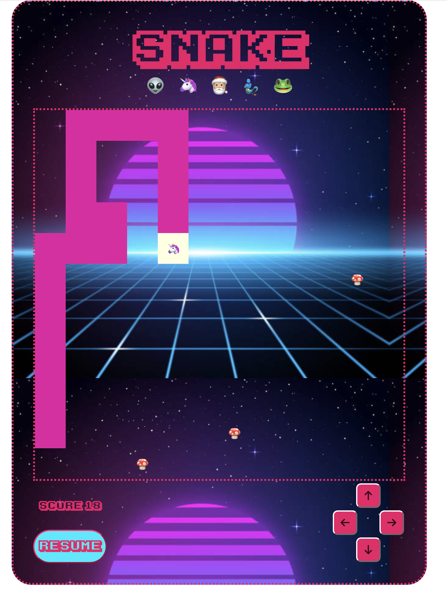

### Brief

Choose a “mini-game” to rebuild with HTML, CSS and JavaScript. The requirements are:

- The webpage should be responsive ✅
- Choose an avatar at the beginning of the game ✅
- Keep track of the score of the player ✅
- Use the keyboard to control the game (indicate what are the controls in the page). You can also use buttons (mouse), but also keyboard. ✅
- Use some multimedia files (audio, video, …) ✅
- Implement an “automatic restart” in the game (that is not done via the refresh of the page) ✅

### Screenshots:
### 

### 

### Snake description:
I chose snake, which I am sure we are all very familiar with. My game has the original simple logic where a snake chases an apple. However, which some creative liberties I made it a little bit more interesting and unique. You can choose your avatar, and which the avatar the "apple" also changes. With every time the snake (or genie, santa, frog etc) its the apple the snake grows and the speed increases, aswell as an mp3 audio file being played. You can change the direction of the snake-movement with your keyboard or the direction buttons. You can also pause and resume the game whenever. 

### Functions:
Lets start with declaring and explaining some of the variables that are used and decalred in my js. 

I start by defining the grid size, and the Array of cells that make up the grid. It´s a 2D array with rows with column-cells. 

I define the apples-array, which will later be constantly set to length 3. 

The default movement-direction is set to up. 

To enable pausing the game I used a boolean which is set to false, and turns true when it´s eventListener is clicked. 

I access the avatars, and define the default head of the snake = a frog. 

The speed speeds up the more apples you eat. To enable the speeding up I set a default speed variable, then a increment-variable of 10, and a minimum speed. 

Lastly I define and fill the snake with 3 cells, so that it is not empty to begin with. The snake is also an array, 

## Now the build:
I have 3 main structures – the grid/cells, the snake and the apples. 
The grid, which is a 2D Array of rows each with 12 column-cells. Every cell is its own element, and can be accessed by [row-index][column-index]. This is how the snake and the apples take form. Every cell in the grid-array represents one cell, which is used to draw the snake and the apple (both regular arrays of cells that have/are the qualities row and colum).

Summ: Grid is a 2D array of rows with (column-)cells. The apples and the snake are visualised by accessing different cell-elements, which can be found in the resepctive array. 

## Functions:
The first functions to be called are makeGrid(), makeApple() and showSnake(). These are all loaded after the DOM-content is loader through an EventListener.

# function makeGrid() 
Loops through the 2D-array to create a cell-element for every element of the grid, which is 144 as the grid-size is always 12. Although it does not return anything, we are left with a grid of cell-elements after this function is called. 

# function makeApple() 
simple function to fill the apple-array and scatter the apples around the grid. Start by while-looping through the set amount of apples and creating variables to store random coordinates where the apples can be places. In other words we are generating random row and column-coordinates for the cell-elements. I added a small if check to make sure the apples are not generated in the same coordinates as the head-snake-element.

# function showSnake() 
starts by looping through all the elements and filling them with `` emptyness. The default of the grid-cells is naturally to be empty. 
Then we loop through the snake-array, which by default is 3 elements of row and column-coordinates. For every "snakepart"/element we make temporary variables r and c to access the snake-elements coordinates. The variables are usedful to check and differentiate between the head-element and the rest of the body. 
For every element we update the style/fill with background-color and an emoji. We have to check for which avatar is currently chosen as every avatar has different colors. 

Then we draw in the apples in the same fashion. Again the different avatars have different apples  which require an if-else check. 

