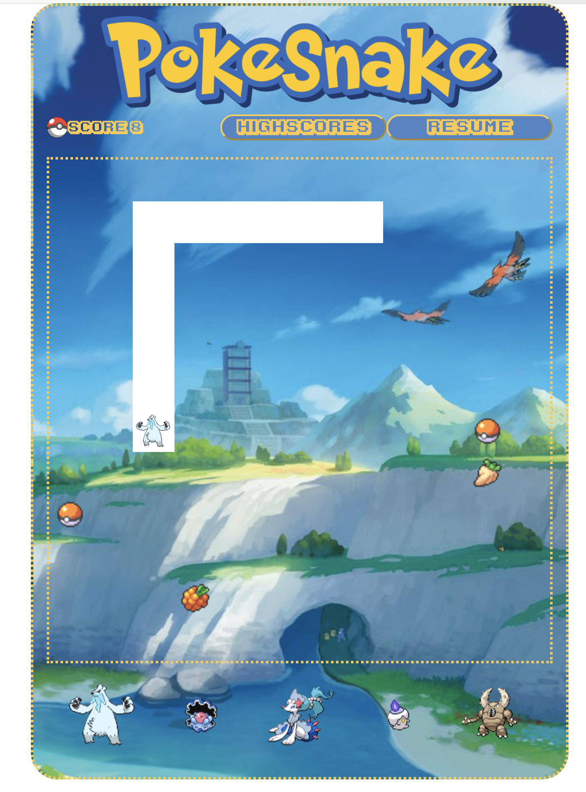
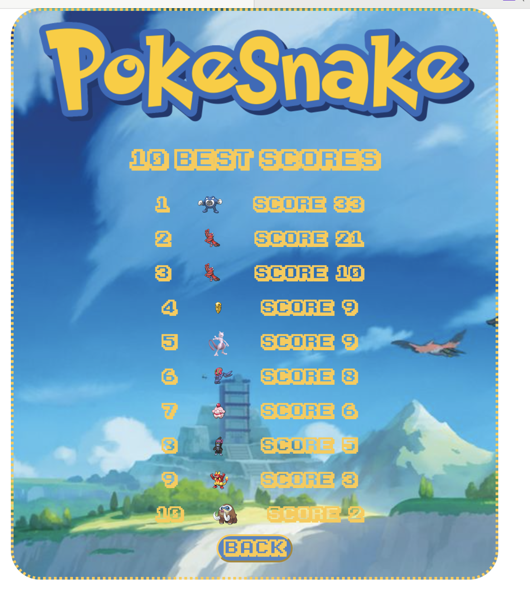
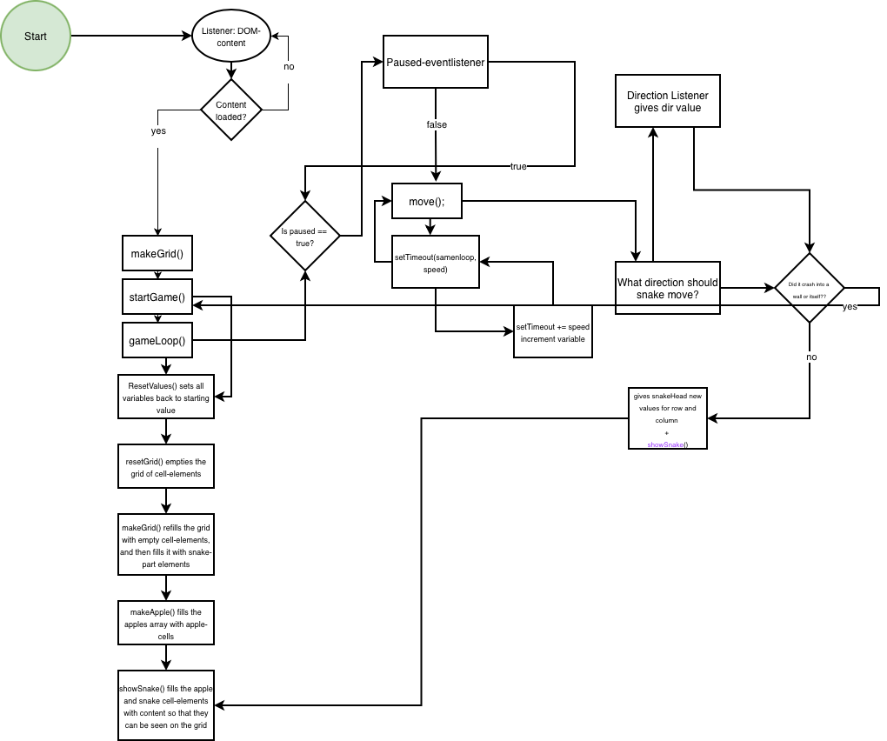

# Brief

Choose a “mini-game” to rebuild with HTML, CSS and JavaScript. The requirements are:

- The webpage should be responsive ✅
- Choose an avatar at the beginning of the game ✅
- Keep track of the score of the player ✅
- Use the keyboard to control the game (indicate what are the controls in the page). You can also use buttons (mouse), but also keyboard. ✅
- Use some multimedia files (audio, video, …) ✅
- Implement an “automatic restart” in the game (that is not done via the refresh of the page) ✅
- Use a web API (you choose which one best fists for your project) to load the data and display them in the webpage ✅
- At least one multimedia file (for user feedback interactions, or content itself) ✅
- Develop a navigation system that allows the user to navigate different sections with related content and functionalities ✅

# Screenshots:

###

###

### Snake description:

I chose snake, which I am sure we are all very familiar with. My game has the original simple logic where a snake chases an apple. However, which some creative liberties I made it a little bit more interesting and unique. You can choose your avatar, and which the avatar the "apple" also changes. With every time the snake (or genie, santa, frog etc) its the apple the snake grows and the speed increases, aswell as an mp3 audio file being played. You can change the direction of the snake-movement with your keyboard or the direction buttons. You can also pause and resume the game whenever.

New addition: Pokemon API! I have updates the avatars to be random pokemons, and added poisonous poke-berries. The apples are also updated to be pokeballs. I have also added a new screen which shows the top 10 best games and which pokemon has the best score.

I stupidly did not save the Drawio file and am unable to update it it with the API calls. The API is called in getRandomBerry(), getRandomPoke() and getPokeball() and are all used in my make and show functions.
MakeAPple calls getPokeBall to get the icon for the apples. makePoisonBerries() calls getRandomBerry and send it to the startGame() funtion to fill it with poisonous berries. makeAvatar calls getRandomPoke() to get the pokemons png and color.

The highscore is updated in eatApple by calling upDateScore() and is saved whenever startGame() is called with a function saveHighscore() to check and see if the score is worth saving. Its is showed through showHighscore() which pushes it to html.

# Functions:

Lets start with declaring and explaining some of the variables that are used and decalred in my js.

I start by defining the grid size, and the Array of cells that make up the grid. It´s a 2D array with rows with column-cells.

I define the apples-array, which will later be constantly set to length 3.

The default movement-direction is set to up.

To enable pausing the game I used a boolean which is set to false, and turns true when it´s eventListener is clicked.

I access the avatars, and define the default head of the snake = a frog.

The speed speeds up the more apples you eat. To enable the speeding up I set a default speed variable, then a increment-variable of 10, and a minimum speed.

Lastly I define and fill the snake with 3 cells, so that it is not empty to begin with. The snake is also an array,

# Now the build:

I have 3 main structures – the grid/cells, the snake and the apples.
The grid, which is a 2D Array of rows each with 12 column-cells. Every cell is its own element, and can be accessed by [row-index][column-index]. This is how the snake and the apples take form. Every cell in the grid-array represents one cell, which is used to draw the snake and the apple (both regular arrays of cells that have/are the qualities row and colum).

Summ: Grid is a 2D array of rows with (column-)cells. The apples and the snake are visualised by accessing different cell-elements, which can be found in the resepctive array.

I have tried to logically cluster the functions by use - first the makeGrid, then all the get functions which collects data from the APIs, then the make-functions which use the the get functions to fill the structures they make (mostly arrays). Then the show functions which fills the grid-cells/arrays made in the make-functions with content. Then comes the move function which is where all the magic happens, and then the other random functions such as eatApple, updateScore, resetValues etc, which are less logical shorter functions.

# Functions:

The first functions to be called are makeGrid(), makeApple() and showSnake(). These are all loaded after the DOM-content is loader through an EventListener.

## function makeGrid()

Loops through the 2D-array to create a cell-element for every element of the grid, which is 144 as the grid-size is always 12. Although it does not return anything, we are left with a grid of cell-elements after this function is called.

## function getRandomPoke()

generates the pokemon xD
Uses random randit to get a number between 1 and 1025, which is the amount of pokemon.
Then it uses the same logic as from the weather API to fetch, parse and use the data from the API. First we are making the URL with for the specific pokemon. Then, because Pokemon is such a big API there are several layers to the API and we need to use several URLs to get to the deeper levels. The first URL presents a list of other URLs – we are interested in the qualities color and sprites. The sprite can be collected from the OG URL, but the color is in the species-URL which is loaded in the second fetch(). The function returns a Pokemon png and its color.

## function getRandomBerry()

generates the random berries using the same logic as for the Pokemon. We are interested in the berry-png, which can be found by lookign through 3 URLs. There might be a more effective way to get to the berry tbh.

## function getPokeball()

again same fetching-logic. This time only URL is needed to get the png we want.

## function makeApple()

simple function to fill the apple-array and scatter the apples around the grid. Start by whilelooping and checking how many elements are in apple-array. If less than amountOfApples Variable it creates new apples. To create the apples it generates variables to store random coordinates where the apples can be placed. In other words we are generating random row and column-coordinates for the cell-elements. I added a small if check to make sure the apples are not generated in the same coordinates as the head-snake-element, by using a boolean which is switched if the coordinates match. The apple will only be added to the array if the boolean is false.

## function makePoisonBerries()

is almost identical to makeApple()-function, except it generates berries and not apples.

## function makeAvatars()

gets the avatars div from the html and emtpies every element. Makes 5 avatars using the getRandomPoke()-function. Gets the png and the color of the pokemon. And makes the ava-element clickable by an eventlistener that updates the headAvatar to the clicked avatar.

## function showSnake()

starts by looping through all the elements and filling them with `` emptyness. The default of the grid-cells is naturally to be empty.
Then we loop through the snake-array, which by default is 3 elements of row and column-coordinates. For every "snakepart"/element we make temporary variables r and c to access the snake-elements coordinates. The variables are usedful to check and differentiate between the head-element and the rest of the body.
For every element we update the style/fill with background-color and an emoji. We have to check for which avatar is currently chosen as every avatar has different colors.

Then we draw in the apples in the same fashion. We go though the array we made in makwApples, to access each element. Again the different avatars have different apples which require an if-else check.

## function showApples()

now its own function to show the pokeballs<3 Loops through the apples-array which is already filled with apples/pokeball elements. Now fills the cells with pokeball icon which is given its value in makePokeBall. For performance sake it includes some fallbacks in case something happens with API.

## function showPoisonBerries()

Does excatly the same as showApples except it shows the berries that are given its value/content in getRandomBerry and makePoisonBerries. Also includes fallback.

## function showHighscore()

gets highscore html-element and creates li items to fill it with. It loops through the exisiting scores in the highscore-array which uses localStorage to save the scores from game to game. Generates the list of the top 10 best scores, and gives the value of avatar-png and score to fill the table with.

## function move()

Is a crutial function. It starts by checking if the global variable is true or false, and returns if true/paused. The snake is not supposed to move when the game is paused, of course. If not paused it continiues by accessing the head of the snake, which is the only element we need to worry about. It creates a "temporary" variable which will act as the new head after collecting the direction of the move. To begin with it is just a copy of the current head.
I made 4 buttons, dir-buttons, which represent the directions the snake can move in. My code if-checks which direction is active. This is possible through the global variable dir which is updated by an eventListener. Depending on the direction the newHead variable is updated, either if (dir === "up") newHead.rc--;
if (dir === "down") newHead.rc++;
if (dir === "right") newHead.cc++;
if (dir === "left") newHead.cc--;
But it is unfortunately not that simple. The movement is restrained. The snake should not move out of the grid, and should not eat itself. To make the constraints I check whether the newHeads rows and column-values are greater than the grid size, or less than 0. If this is true then the restartGame() is called and the move functions quits/returns.
If false, aka the coordinates are inside the grid, the snake-array calls the unshift() variable with the value of the newHead snake, which turns the new head into index 0 of the array.
Then we check if the newHead collides with the apples, by a simple if check of all the apple-elements compared to the new head. If the newHead does share the same coordinates as one of the Apple-cells the eatApple()-funtion is called. I used a boolean variable ate to control the growth of the snake array. The snake should grow by one cell every time an apple is eaten, which I fixed by only reoving the tail-element if the snake does not eat an apple. If the snake does eat an apple the tail continues to be part of the snake, and if not the tail is pop()ed. Quite celever I must say.
Lastly we check if the snake eats itself by comparing every snake-cell to the head. If there is a match between snakeHead and snakebody the restartGame()-funtion is called, and the fucntion returns.
Lastly-lastly the showSnake() is called, as the snake-array has been updated.

## function restartGame()

simply calls method reload() which restarts the page.

## function updateScore()

uses global variable score which is updated in the eatApple()-funtion to update HTML-element score every time an apple is eaten. It is called in eatApple()-funtion.

## function eatApple()

does a few more things than just eating apples. First off all it takes the argument apple, and uses the index to splice() one element from the Apple-array.
It updated the score variable by one count, then calls updateScore to send to html.  
Then it collects the html-audio element and plays the clip. So every time an apple is eaten the same sound plays.
Then it updates the speed.
Lastly it calls makeApple() as the apple array must be updated (should always be 3 apples in there.)

## function gameLoop()

Is responsible for the speed of the snake. It creates intervals for calling the move()-function. Is uses setTimeout which allows for incrementing the speed per call as it takes the global speed-variable as an argument. The speedvariable is incremented in the eatApple-funtion. It collects the global speed variable which is updated using the increment-variable every time an apple is eaten in the eatApple()-function. By getting the updated speed it can call the setTimeout()-method with the new speed as the interval. It calls itself to check pause-boolean, and is called for the first time to start it in the DOM-Content-eventListener-scope.

## function resetValues()

    Simply resets all the variables so that the game can be restart without using .reload()

## function resetGrid()

    Makes all the cell-elements go back to "empty"/unfilled, and removes them from the grid so that they can be filled when the game is restart in the way it is supposed to with the makeGrid()-funtion.

## function startGame()

    Simply calls functions needed to start game. It start with calling the reset-functions, and then remakes the grid, snake and apples.

## function saveHighscore()

assigns a fallback avatar-png just in case something is wrong with the avatar/pokemon png load. then loops through highscores-array to check if the pokemon is already featured on the scoreboard – if so it if checks whether the new score beats the old score, if not the score is not used. This is to ensure that the same pokemon can only be featured once.
If its not already featured than it is added to the list, the list is sorted, and then spliced by 10 to only keep the 10 best scores. Then uses localStaorage to store the newly updated list.

## Now the EventListeners

There are quite a few:)) I start by making sure all the DOM-content is loaded. When the content is loaded we can call the startGame()-funtion aswell as the fist calling of the gameLoop, and the makeGrid().

The rest of the listeners take care of the buttons, by listening and updating global variables when clicked. For the direction-buttons the dir-variable is updated which is responsible for the direction the snake moves. The pause/resume variable is updated and toggled between resume and pause by updating the varibales value between true and false. Both listenes for button-clicks and for keyboard button use. The pause/resume listenes to the space-key, and directions are naturally the arrowns on the keyboard.

New: new eventlistener for highscore-screen navigation. displays either the gamescreen or the highscore screen depending on the click on the highscore/back-button.

## Content and data sources

bite sound: https://www.myinstants.com/en/instant/pokemon-item-found-50824/
https://www.myinstants.com/media/sounds/pokemon-red_blue_yellow-item-found-sound-effect.mp3
